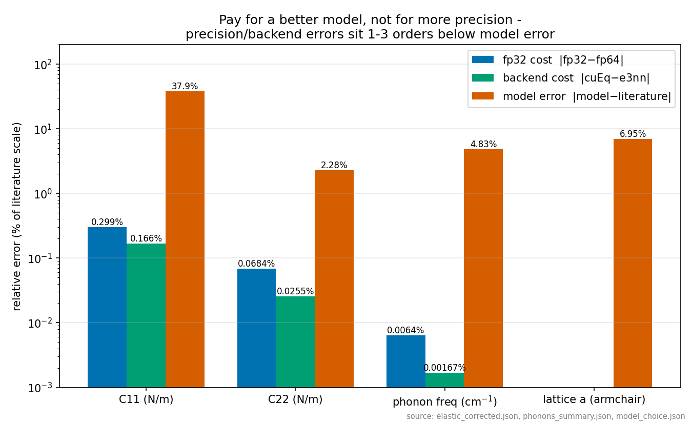
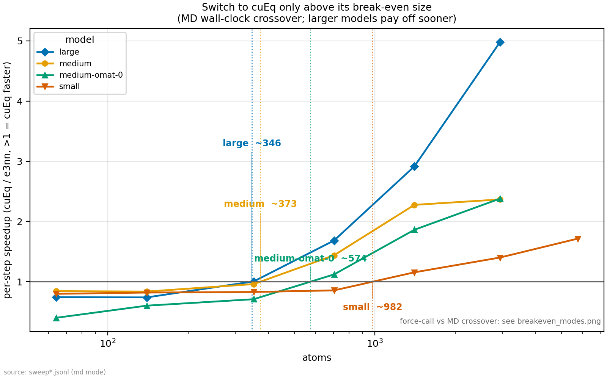
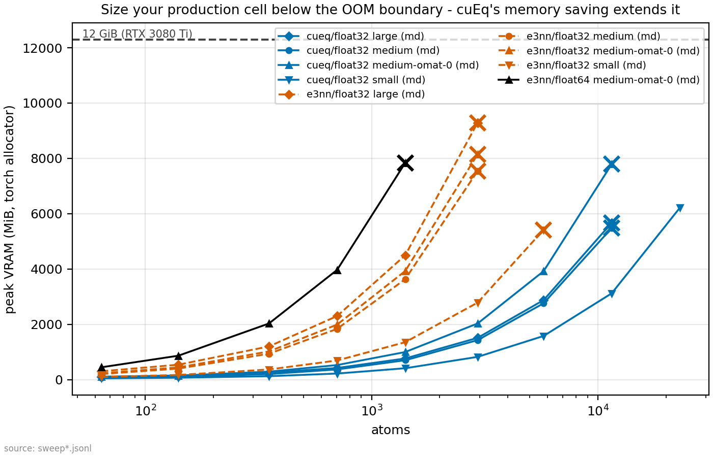
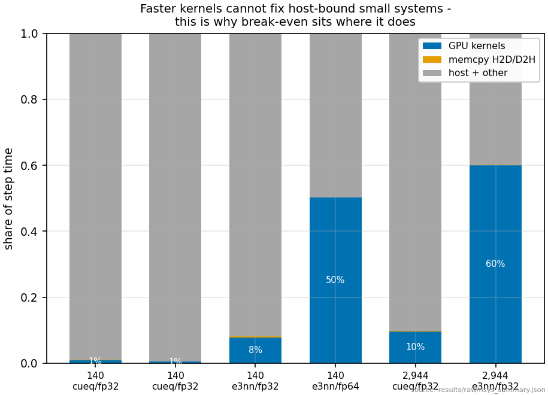
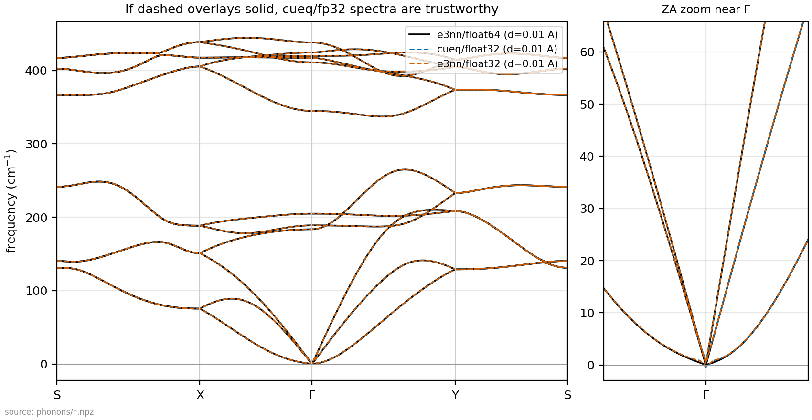

# phosbench

**Production MLIP molecular dynamics on the GPUs university labs already own —
an end-to-end deployment study on black phosphorus (RTX 3080 Ti, 12 GB).**

Machine-learned interatomic potentials (MACE foundation models) promise
DFT-quality MD at classical cost — but the published acceleration numbers
(NVIDIA's cuEquivariance-in-LAMMPS results, Oct 2025; arXiv:2510.23621) are
water benchmarks on datacenter A100/H100s, throughput-first. The hardware a
typical university lab actually owns is a workstation RTX card, where fp64
runs at 1/64 of fp32 throughput and VRAM is 12 GB. This study measures, on
monolayer phosphorene (a maximally anisotropic 2D semiconductor), what it
takes to run **trustworthy production MD** on that hardware: when
cuEquivariance pays off and when it does not, what fp32 does to *physical
observables* (phonon dispersions, anisotropic elastic constants, energy
drift — not force RMSE), and where the time actually goes (Nsight). Every
figure caption states the deployment decision it informs.

> **Scope discipline**: this extends the published datacenter throughput
> results to the consumer break-even boundaries and solid-state observables
> that drive real lab deployment decisions. It is *not* the first consumer
> MACE benchmark (arXiv:2510.23621 includes an RTX 2080 Ti) — it is, to our
> knowledge, the first break-even/OOM characterization and the first
> precision-vs-solid-state-observable study for the MACE + cuEquivariance
> stack.

## TL;DR — the recommendation matrix

For a lab running MACE-class potentials on a 12 GB RTX workstation:

| system size | backend & precision | why (measured) |
|---|---|---|
| below break-even (~313–346 at. large, ~373–454 medium, ~947–982 small) | e3nn / fp32 (cuEq off) | step time is host-bound (GPU kernels ≤ 8% of step); cuEq kernels make it *slower* (×0.74–0.96 for the MP-0 family, down to ×0.40 for OMAT-medium at 64 atoms) |
| break-even – ~3,000 atoms | **cuEq / fp32** | ×1.4 (small model) to ×5.0 (large model) per-step speedup at 2,944 atoms |
| ~3,000 – 23,000 atoms | **cuEq / fp32** (above 5,760 atoms, the only option) | e3nn OOMs at 2,944 (medium/large) – 5,760 (small) atoms; cuEq's ×3.4–6.1 smaller activation memory reaches 11,520 (medium) – 23,040 (small) atoms |
| any size, fp64 | don't — use e3nn/fp64 *sparingly* for reference data | fp64 costs ×3.2 (64 at.) to ×10 (1,408 at.) on GA102; last working rung 1,408 atoms (OOM at 2,944) |
| property workflows (phonons, elastic) | **hybrid**: displaced-force evaluations on e3nn/fp64, production MD on cuEq/fp32 | fp32 finite-difference noise pollutes small displacements: at the standard 0.01 Å amplitude it adds ~0.03–0.04 cm⁻¹ RMSE and spurious imaginary acoustic points — harmless under the standard 0.3 THz 2D-flexural tolerance, but enough to flip a naive ω² > 0 stability check; fp32 forces an explicit displacement-amplitude choice |
| CPU (8-core Ryzen 5800X) | never for this workload | GPU wins ×13 even at 64 atoms, ×64 at 1,408 |


*The chart that settles the precision argument: per observable, fp32 and
backend errors are 1–3 orders of magnitude below the model-vs-literature
error.*

**The error budget that matters**: across every observable we measured,
|fp32 − fp64| and |cuEq − e3nn| are **≤ 3 % (typically ≤ 1 %)** of
|model − DFT-literature| — worst case C22, where 0.07 N/m of precision spread
stands against 2.4 N/m of model error. Numerical precision is not the error
you should pay to reduce — model choice is (see *Zero-shot validation
failure*, below).

## Headline figures

| | |
|---|---|
|  |  |
| *Below the model-dependent crossover (~313–982 atoms), leave cuEq off — the host, not the kernel, limits the step.* | *On 12 GB, cuEq buys a ×3.9 reachable-size increase before it buys speed; size production cells from `oom_boundary.csv`.* |
|  |  |
| *Faster kernels cannot fix host-bound small systems; after cuEq, the ASE loop is the next bottleneck.* | *cuEq/fp32 (dashed) reproduces the e3nn/fp64 dispersion to ≤ 0.08 cm⁻¹ per branch — fp32 production MD is physically safe here.* |

## Key findings

1. **Break-even is real and model-size-dependent.** cuEquivariance crossover
   sits at ~313–346 atoms (MACE-MP-0 large), ~373–454 (medium), ~947–982
   (small). For three of four models the wall-clock (MD) crossover lands later
   than the bare force-call crossover — ASE host overhead delays it; medium is
   the measured exception (373 MD vs 454 force-call). Below break-even cuEq
   *costs* up to 26 % (and 60 % for OMAT-medium at 64 atoms).
2. **cuEquivariance's bigger gift on 12 GB is memory, not speed.** At 2,944
   atoms (medium model) cuEq peaks at 1.4 GiB where e3nn needs 7.4 GiB
   (×5.3; ×3.4–6.1 across models); the reachable system size grows ×3.9
   (2,944 → 11,520 atoms). The OOM boundary per config is tabulated in
   `results/figures/oom_boundary.csv`.
3. **After acceleration, the bottleneck is the host.** Nsight: at 140 atoms the
   GPU is busy 1 % of the step (cuEq) — faster kernels cannot help; at 2,944
   atoms e3nn keeps the GPU 60 % busy vs cuEq's 10 %. cuEq shifts the limiter
   from kernels to the Python/ASE loop: the production path beyond this study
   is LAMMPS ML-IAP (Kokkos) or CUDA-graph-style batching, per NVIDIA's
   datacenter results.
4. **fp64 is effectively unavailable on consumer Ampere.** ×3.2–×10 measured
   cost (the fp64 GEMMs dominate the timeline: `cutlass...d884gemm` kernels at
   74 % of kernel time), ×2 memory, last working rung 1,408 atoms (OOM at
   2,944). Consumer deployment *forces* the fp32 question — which is exactly
   why the accuracy gates below matter. (On A100/H100 fp64 is 1:2, so the
   datacenter column of the matrix differs.)
5. **fp32/cuEq preserve the physics — measured, not assumed.**
   - Parity gate (cuEq vs e3nn @ fp32, 140 atoms): ΔE below fp32
     representation resolution (both backends round to the bitwise-identical
     fp32 energy), max |ΔF| = 5×10⁻⁴ meV/Å.
   - Phonon dispersion: per-branch RMSE ≤ 0.08 cm⁻¹ (fp32 vs fp64), invisible
     against the ~20 cm⁻¹ scale separating the model's top optical mode from
     the bulk Raman lines (context, not a fitted comparison).
   - Anisotropic elastic constants: C11/C22 = 33/105 N/m, identical to 0.22 %
     across e3nn-fp64 / e3nn-fp32 / cuEq-fp32, from relaxed-ion energy
     curvature (R² > 0.9997). C12 ≈ 30 N/m comes from the stress cross-slope
     rescaled by the measured ×17.8 factor (finding 8) — uniform-scaling
     assumption, flagged — and sits well above the ~18 N/m PBE literature
     value.
   - NVE drift (512 atoms, 25 ps, 300 K): |slope| ≤ 0.011 µeV/atom/ps in all
     three cells — fp32/cuEq conserve energy as well as fp64 at this horizon.
     Bonus deployment fact: free-running NVE (no per-step sync) runs cuEq at
     31 ms/step vs the 78 ms/step the per-step-synced harness measures at this
     size — cuEq pipelines launches ahead, so the sweep's break-even numbers
     are *conservative* for production MD.
   - NPT lattice: invalidated by the upstream stress inconsistency — see
     finding 8; the failure itself is precision/backend-independent.
6. **…but fp32 changes *how you must measure*.** Finite-difference phonons at
   the standard 0.01 Å displacement pick up fp32 force noise: spurious
   imaginary acoustic artifacts at −0.007 THz (e3nn) to −0.012 THz (cuEq)
   that shrink (cuEq: −0.003 THz) or change sign (e3nn) at 0.05 Å — while
   fp64 shows the opposite trend, clean at 0.01–0.03 Å and picking up its own
   −0.002 THz anharmonic artifacts at 0.05 Å. No verdict changes under the
   standard 0.3 THz 2D-flexural tolerance; the deployment point is that fp32
   makes the displacement amplitude an explicit engineering choice instead of
   a default. Hence the hybrid policy in the matrix.
7. **Zero-shot validation failure caught before deployment.** All three
   foundation models tested (MACE-MP-0, MACE-MPA-0, MACE-OMAT-0) reproduce the
   zigzag lattice constant within 0.9–2.6 % but compress the soft armchair
   axis by **7–10 %** (4.17–4.30 Å vs 4.62 Å DFT) — exactly the direction
   whose DFT stiffness is ~4.3× lower (C11 ≈ 24 N/m vs C22 ≈ 103 N/m).
   Anisotropy survives zero-shot (C22/C11 = 3.2 vs ~4.3 DFT) but absolute
   armchair stiffness comes out ~38 % high against literature. A potential you
   have not validated on *your* material's soft direction is not
   production-ready; fine-tuning on the open GAP-20 phosphorus dataset is the
   documented next step.
8. **Measured here: MACE analytic stress is ×17.8 off on this slab.**
   Hellmann-Feynman check (`scripts/90_diag_stress_hf.py`): analytic
   `get_stress()` is 17.81× smaller than dE/dε of the same energy surface
   (e3nn/fp64/CPU — independent of cuEquivariance; a fully-periodic control
   on the same script isolates the slab geometry as the trigger). Stress-slope
   elastic constants are unusable on pbc=[T,T,F] geometries with mace-torch
   0.3.16; this repo's C11/C22 use energy-curvature fits (R² > 0.9997).
   The bug also poisons NPT: the barostat balances an *unscaled* kinetic
   pressure against a ×17.8-undersized virial, so the cell inflates
   monotonically (~+20 % in-plane over 50 ps, identical across e3nn-fp64 /
   e3nn-fp32 / cuEq-fp32 — three-way agreement that exonerates
   precision/backend and indicts the stress path). Deployment rule until the
   upstream fix: no Berendsen/Parrinello-style barostats on partially
   periodic MACE systems. Upstream issue with this minimal repro: in
   preparation.

## Known-issues table (what we worked around, honestly)

| issue | consequence here |
|---|---|
| cuEq + fp64 reported broken upstream (MACE #1203, #1298) | did **not** reproduce on this stack: the cuEq/fp64 probe ran, matched the fp64 reference, and nsys shows real cuEq kernels (`segmented_polynomial_*` + fp64 `d884gemm`) — no silent fallback. The cell stays out of the headline matrix anyway: GA102 fp64 is hardware-inappropriate (finding 4) |
| SM86 is not a tuned cuEq target (kernels are SM80/90/100+) | speedups here are a *lower bound*; verified real cuEq kernels run via Nsight (`segmented_polynomial_*`) — no silent fallback |
| torch.compile × cuEq zero-gradient bug (cuEq #77) | torch.compile disabled everywhere |
| MACE slab stress ×17.8 (this work, `90_diag_stress_hf.py`) | elastic constants via energy curvature; NPT relaxes ~18× slower than nominal |
| consumer boost clocks drift | no root to lock clocks → SM clock/temp/power logged per measurement, medians of per-step laps reported |
| ncu hardware counters need `NVreg_RestrictProfilingToAdminUsers=0` | kernel analysis via nsys timelines only (sufficient for time-share) |

## Reproduce

```bash
# one-time: structure + gates (fails loudly if your stack is broken)
bash scripts/stage_a.sh
# sweeps / accuracy arms / profiling (hours; queue-friendly, resumable)
python scripts/10_sweep_throughput.py --backends e3nn,cueq --dtypes float32 \
    --models small,medium,large,medium-omat-0 --modes md,force_call
python scripts/20_phonons.py --displacements 0.01,0.03,0.05
python scripts/21_elastic.py && python scripts/23_elastic_recompute.py
python scripts/22_md_stability.py
bash scripts/30_profile_nsys.sh
python scripts/40_make_plots.py && python scripts/41_error_budget.py
# stretch: repair the armchair axis by fine-tuning on GAP-20 (Zenodo 4003703)
python scripts/50_finetune_prep.py && bash scripts/51_finetune.sh
```

Pinned stack (verified): mace-torch 0.3.16 · cuequivariance(-torch/-ops) 0.10.0
· torch 2.11.0+cu128 · e3nn 0.4.4 · ase 3.28.0 · phonopy 4.1.0 · driver 610.43
(CUDA 13.3) · Ubuntu 24.04 · RTX 3080 Ti 12 GB · Ryzen 7 5800X.

Protocol design, gate thresholds and the schedule that produced this in
~2 days: [PROTOCOL.md](PROTOCOL.md). The 2-page consulting-style summary for
a lab deciding *today*: [docs/engagement-memo.md](docs/engagement-memo.md).

## Where this goes next

- **Datacenter column**: the sweep harness is config-driven and re-runs
  unmodified on A100/H100 (fp64 at 1:2 changes the precision economics;
  SM80-tuned kernels should raise the cuEq column). Published water numbers
  suggest ×3–5 at scale — our large model reaches that bracket at 2,944
  atoms (×5.0); medium sits at ×2.4, small at ×1.4–1.7.
- **Scaling out**: LAMMPS ML-IAP (Kokkos) is the supported multi-GPU path —
  the configuration behind NVIDIA's Oct 2025 LAMMPS numbers. Note the
  deployment subtlety: the ASE-side `enable_cueq=True` runtime conversion is
  not what LAMMPS consumes; LAMMPS takes the exported e3nn model through its
  own cuEquivariance-accelerated ML-IAP route. An ASE-vs-LAMMPS single-GPU
  step-time comparison on this card is the next measurement on the list.
- **Model fix**: time-boxed fine-tune on GAP-20 (Zenodo 10.5281/zenodo.4003703)
  to repair the armchair axis, then re-run *only* the accuracy arms (the
  benchmark numbers are model-fidelity-independent by construction).
