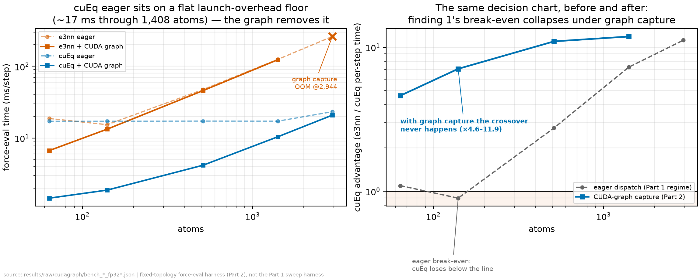

# CUDA Graphs close the host gap — where finding 3 predicted they would

*Part 2 full study (README carries the condensed version). Numbers are verbatim from
`results/raw/cudagraph/bench_cueq_fp32.json` and `bench_e3nn_fp32.json`; figure
is `results/figures/cudagraph_speedup.png`. RTX 3080 Ti, mace-torch 0.3.16,
torch 2.11.0+cu128, cuEquivariance 0.10.0, mace_mp medium (MP-0), fp32.*

## The claim under test

Finding 3 of the main study showed that **after** cuEquivariance, the GPU kernels
occupy only ~10 % of the MD step at 2,944 atoms — the Python/ASE loop and per-step
kernel-launch latency dominate. The finding named the fix but did not run it:
"the production path beyond this study is LAMMPS ML-IAP (Kokkos) or
**CUDA-graph-style batching**." Part 2 runs the CUDA-graph half of that sentence
and measures what comes back.

A CUDA graph records a whole stream of kernel launches once and replays them as a
single host call, eliminating the per-launch CPU dispatch cost. If finding 3 is
right — if the small-system MACE step really is launch-latency-bound — then a
graph should give a large speedup at small sizes that decays to nothing as the
system grows and real kernel work takes over. That decay curve is the prediction;
the numbers below are the test.

## How it was measured

A **fixed-topology** force-eval path (`scripts/70_cudagraph_gate.py`): the
MACE `AtomicData` batch is built once through the calculator's own converter, so
`edge_index`, `unit_shifts`, `shifts`, `node_attrs`, `cell`, `batch`, `ptr` are
frozen. Only `positions` is a live static buffer. Because we request
`compute_stress=False`, MACE takes its simple branch where the edge vectors are a
pure function of positions, `v = pos[recv] − pos[send] + shifts`, with the
neighbour list held constant. New positions are copied into the static buffer, the
graph is replayed, and forces are read from a static output buffer.

`torch.compile` was **not** used (it triggers the cuEq #77 zero-gradient bug). The
capture is hand-rolled with `torch.cuda.graph`, whose private memory pool lets the
`torch.autograd.grad` force computation allocate its transient buffers inside the
graph and reuse them across replays.

**Parity gate before any timing.** On identical positions and topology, graph-replay
forces were compared to eager forces:

| size | parity max\|ΔF\| (eV/Å) | ΔE (eV) |
|------|------------------------|---------|
| 140  | 5.1×10⁻⁷               | 0       |
| 512  | 6.3×10⁻⁷               | —       |
| 2,944| 8.0×10⁻⁷              | —       |

All three are at fp32 roundoff (tol was 1×10⁻⁴ eV/Å) — the graph reproduces the
eager forces bit-for-bit up to accumulation order. A second-geometry check confirms
the replay actually tracks new positions (forces change by ~10⁻¹ eV/Å between
geometries) rather than replaying a frozen answer.

Timing follows the main study's discipline (`phosbench/common.py`): ≥15 warmup
steps, median + p10/p90 of per-step laps, SM clock/temperature logged per point
(unlocked consumer boost — disclosed). Each size is timed three ways on identical
0.01 Å-rms perturbations: eager per-step-synced (the sweep harness's number),
eager free-running, and graph replay.

## What came back (cuEq / fp32)

| atoms | edges | eager synced (ms) | eager free (ms) | graph (ms) | graph vs synced | graph vs free | parity max\|ΔF\| |
|------:|------:|------------------:|----------------:|-----------:|----------------:|--------------:|-----------------:|
| 140   | 4,340 | 17.14             | 17.06           | **1.88**   | **9.1×**        | **9.1×**      | 5.1×10⁻⁷ eV/Å   |
| 512   | 15,872| 17.23             | 17.21           | **4.18**   | **4.1×**        | **4.1×**      | 6.3×10⁻⁷ eV/Å   |
| 2,944 | 91,264| 23.26             | 23.21           | **20.85**  | **1.12×**       | **1.11×**     | 8.0×10⁻⁷ eV/Å   |

This is exactly the decay curve finding 3 predicted, and it validates finding 3
rather than overturning it:

- **At 140 atoms the force eval is ~94 % host overhead.** Eager sits at a flat
  ~17 ms/step floor that is *independent of system size* from 140 to 512 atoms —
  that floor is the Python + kernel-launch dispatch cost, not GPU work. The graph
  collapses it to **1.88 ms** with zero jitter (p10 = p90 = 1.88), because the whole
  step is now one deterministic replay. **9.1× faster.**
- **At 512 atoms** the graph still wins **4.1×** (17.2 → 4.2 ms): real kernel work is
  starting to fill the step but launch overhead is still most of it.
- **At 2,944 atoms** the graph gives only **1.12×** (23.3 → 20.9 ms). Here the
  kernels genuinely occupy most of the step — precisely the ~10 % host share
  finding 3 measured by Nsight. There is little launch overhead left to reclaim, so
  a graph can't manufacture speed the hardware isn't leaving on the table.

**Bonus:** the graph is also *leaner*. Peak allocator VRAM drops from 103 → 67 MiB
(140), 327 → 103 MiB (512), and 1,487 → 143 MiB (2,944) because the private pool
reuses autograd's transient buffers instead of re-allocating them every step. For
cuEq — whose activation footprint is already small (finding 2) — the graph is both
faster and smaller.

## An honest surprise: free-running ≈ synced *here*

The main study reported that free-running NVE (no per-step sync) ran cuEq at
31 ms/step versus 78 ms/step per-step-synced at 512 atoms, because cuEq pipelines
launches ahead when the host doesn't stop to sync. In **this** benchmark the gap is
gone: eager-free (17.06) ≈ eager-synced (17.14) at 140 atoms.

That is not a contradiction — it isolates the cost more sharply. The MD number
includes an ASE VelocityVerlet Python step between force calls, which gives the GPU
slack to run ahead of the host; removing the per-step sync lets that pipelining
show. This benchmark is a *bare* back-to-back force-eval loop with no integrator
Python between calls, so consecutive eager launches can't overlap much — the cost
that remains is the per-call dispatch itself, and *only a graph removes that*. So
the two experiments agree on the mechanism (host-side launch/dispatch is the
limiter for small cuEq systems) and disagree only on which knob exposes it. Report
both; neither inflates the other.

## e3nn context: kernel-bound, so the graph barely helps — and OOMs

For the reference e3nn backend at fp32 the graph gives 1.15× (140), 1.03× (512),
and **fails to capture at 2,944 with a CUDA OOM**: the graph's private memory pool
on top of e3nn's ~7.4 GiB working set (finding 2) exceeds the 12 GB card. e3nn's
heavier kernels mean the step was never launch-bound, so there was little to
reclaim — and the memory headroom the graph needs is exactly the headroom e3nn
doesn't have. cuEq's lean footprint is what lets cuEq + graph fit where e3nn + graph
cannot. This reinforces finding 2 (cuEq's bigger gift on 12 GB is memory) from a
new direction.

## Stretch: batch the below-break-even regime into one graph

The single-cell graph floor at 140 atoms is ~1.9 ms/step, and it is almost all the
one host→device replay launch, not kernel work. So a workload of *many small
independent cells* (an ensemble, replica exchange, a batch of candidate structures
— all in the below-break-even regime the main sweep flagged) can amortise that one
launch by packing N cells into a single `torch_geometric.Batch` and evaluating them
in **one** captured graph. Measured with N = 8 replicas of the 140-atom cell
(cuEq/fp32, 1,120 atoms / 34,720 edges total):

| arm | ms/step | ms per 140-atom cell |
|-----|--------:|---------------------:|
| eager batched (synced)        | 17.52 | 2.19 |
| 8× single-cell graph replays  | 14.03 | 1.75 |
| **one batched graph**         | **8.32** | **1.04** |

Parity (batched-graph vs batched-eager forces): max\|ΔF\| = 5.8×10⁻⁷ eV/Å — the
8-way batch is numerically exact too. Batching into one graph beats replaying the
single-cell graph 8 times by **1.7×** (1.75 → 1.04 ms/cell) and beats eager by
**2.1×**, driving the per-cell cost down toward the actual kernel work. The lesson
for the host-bound small-system regime: don't just capture — *batch the capture*.
One graph pays the launch once for the whole ensemble. (Peak VRAM for the 8-way
batch was 604 MiB, comfortably within budget.)

## The headline consequence: finding 1's break-even collapses — at the force-eval level

Putting both backends' eager and graph numbers side by side exposes what the
main study's break-even actually was:

| atoms | e3nn eager | e3nn + graph | cuEq eager | **cuEq + graph** | graph-era winner |
|------:|-----------:|-------------:|-----------:|-----------------:|------------------|
| 64    | 18.71      | 6.69         | 17.12      | **1.45**         | cuEq + graph, 4.6× apart |
| 140   | **15.35** *(eager-era winner)* | 13.30 | 17.14 | **1.88** | cuEq + graph, **7.1×** apart |
| 512   | 47.39      | 45.84        | 17.23      | **4.18**         | cuEq + graph, 11.0× apart |
| 1,408 | 125.0      | 123.5        | 17.19      | **10.41**        | cuEq + graph, 11.9× apart |
| 2,944 | 260.18     | OOM (capture)| 23.26      | **20.85**        | cuEq + graph |

*(64- and 1,408-atom rows from the extended ladder, `bench_*_fp32_extra.json`;
note cuEq eager sits on the same ~17 ms launch floor from 64 through 1,408
atoms.)*

*The decision chart before/after (`scripts/74_breakeven_graphera.py`).*

Finding 1 located a model-dependent crossover (~313–982 atoms) below which
enabling cuEquivariance made the step *slower*. This table shows that crossover
was never about kernel work — it was a **launch-overhead artifact**. cuEq's
segmented tensor-product kernels are numerous and tiny: under eager dispatch each
one carries a host launch cost while the GPU idles, so at small sizes the launch
bill exceeds the kernel savings. e3nn's fewer, heavier kernels hide their launch
cost under real work. Remove the dispatch cost (capture the graph) and cuEq's
true kernel-work advantage shows at every size measured: **7.1× faster than
e3nn+graph at 140 atoms — the size where eager cuEq loses** — 11× at 512, and at
2,944 atoms e3nn cannot even capture (OOM) where cuEq+graph fits with ~12 GB of
headroom to spare.

The deployment matrix therefore gains a second row rather than losing its first:

- **One-flag eager deployment** (the main study's audience): finding 1 stands
  unchanged — below the crossover, leave cuEq off.
- **Deployment willing to wire fixed-topology/padded graph capture**: the
  crossover disappears — cuEq + graph wins at every size, and the
  below-break-even regime should further *batch* small cells into one graph
  (previous section).

Same boundary as everywhere in this section: established at the bare force-eval
level, not end-to-end MD.

## The decision this informs

For **small-to-medium cuEq/fp32 production cells (≲512 atoms)** on a single
consumer GPU, capturing the MACE force evaluation into a CUDA graph is worth
roughly a **4–9× step speedup** — it removes the host launch overhead that finding 3
identified as the post-cuEq limiter, and it does so at fp32 roundoff parity. Above
~3,000 atoms the step is already kernel-bound and a graph is not worth the
engineering (≈1.1×). The crossover where the graph stops mattering (~3,000 atoms)
is the same place finding 3's Nsight kernel-share crossed ~90 %.

## Honest caveat — this is the regime *between* neighbour-list rebuilds

The measured speedup is for a **frozen topology**: one fixed neighbour list, fixed
`edge_index`, fixed `shifts`. That is physically valid only while atoms move less
than the neighbour-list skin — here the perturbations are 0.01 Å rms against a
6.0 Å cutoff, ~600× under the cutoff, so the frozen list stays correct. A real MD
trajectory eventually moves atoms across cell boundaries and changes the neighbour
count, at which point `edge_index` changes shape and the captured graph is invalid.

**Production MD therefore cannot naively claim this speedup end-to-end.** A real
deployment needs one of: (i) **periodic recapture** — rebuild the neighbour list and
re-capture every N steps (amortised only if N is large enough that recapture cost is
negligible, which is the standard Verlet-skin trade-off); or (ii) **padded capture**
— over-allocate `edge_index`/`shifts` to a fixed maximum edge count with dummy edges
(MACE ships `build_fake_padding_graph` / `padding_tools` for exactly this), so the
graph's shapes survive neighbour-count fluctuations up to the pad budget, at the cost
of computing on padding edges every step.

What this study establishes is the **per-step ceiling** a CUDA-graph MD engine could
reach on this hardware and model, and that the capture is numerically exact. It does
**not** establish an end-to-end MD speedup, and this section should never be cited as
one. The next step to a production number would be wiring padded capture into an ASE
MD driver and measuring including the recapture/padding cost — that is the honest
continuation, and it is out of scope for a per-step ceiling study.
